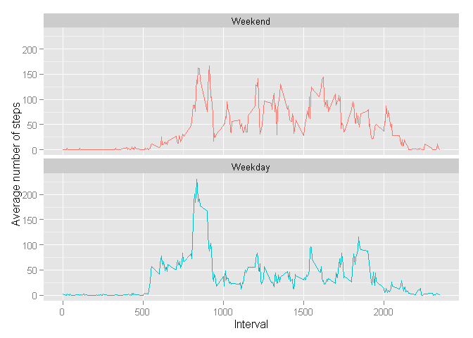

# Reproducible Research - Peer Assignment 1

##Loading and preprocessing the data

Load the necessary libraries and read the CSV 
information to create a dataframe.  Also convert dates 
to POSIX format with lubridate.  This analysis 
requires the CSV file to exist in the working directory.


```r
libs <-c('dplyr', 'ggplot2', 'lubridate')
for(p in libs) suppressPackageStartupMessages(
        library(p, quietly=TRUE,character.only=TRUE)) 
                                                      
csv.data <- read.csv("activity.csv")
csv.data$date <- ymd(csv.data$date)
```

##What is mean total number of steps taken per day?

Calculate the total number of steps, grouped by day (ignoring NA's).
Make a histogram of the total number of steps each day:


```r
total.steps <- tapply(csv.data$steps, csv.data$date, sum, na.rm=TRUE)
qplot(total.steps, xlab='Total number of steps each day', ylab='Frequency')
```

 

Calculate the mean and median total number of steps taken per day:

```r
summary(total.steps)
```

```
##    Min. 1st Qu.  Median    Mean 3rd Qu.    Max. 
##       0    6778   10400    9354   12810   21190
```

##What is the average daily activity pattern?
Make a time series plot of the 5-minute interval (x-axis) and the average 
number of steps taken, averaged across all days (y-axis):


```r
act.pattern <- aggregate(steps ~ interval, data = csv.data, FUN = mean)
ggplot(data=act.pattern, aes(x=interval, y=steps)) + geom_line()
```

 

Calculate Which 5-minute interval, on average across all the days in the 
dataset, contains the maximum number of steps:


```r
max.steps <- which.max(act.pattern$steps)
act.pattern[max.steps,'interval']
```

```
## [1] 835
```


##Imputing missing values
Calculate the total number of missing values in the dataset:

```r
sum(is.na(csv.data))
```

```
## [1] 2304
```


We will use the mean number of steps for each interval as a strategy
to replace the NA values. Create a new tidy dataset and replace the NA values:

```r
tidy.data <- csv.data
tidy.data$steps[is.na(tidy.data$steps)] <- 
        tapply(tidy.data$steps, tidy.data$interval, mean, na.rm=TRUE)
```

Make a histogram of the total number of steps taken each day and Calculate and 
report the mean and median total number of steps taken per day


```r
tidy.steps <- tapply(tidy.data$steps, tidy.data$date, sum, na.rm=FALSE)
qplot(tidy.steps, xlab='Total number of steps each day', ylab='Frequency')
```

 

```r
#mean and median of tidy data without NA values
summary(tidy.steps)
```

```
##    Min. 1st Qu.  Median    Mean 3rd Qu.    Max. 
##      41    9819   10770   10770   12810   21190
```

These values differ from the estimates from the first part of the assignment in 
that the average and median values appear shifted larger. The shape of the 
distribution is similar except for the large spike in the 0 bin.  This is an 
expected result when replacing the na.rm = TRUE values with a value 
greater than 0.  

##Are there differences in activity patterns between weekdays and weekends?
Create a new factor variable in the dataset with two levels -- 
"weekday" and "weekend" indicating whether a given date a weekday or weekend:

```r
tidy.data <- mutate(tidy.data, day.of.week = weekdays(date, abbreviate=TRUE))
fac <- factor(tidy.data$day.of.week)
levels(fac) <- list(Weekend = c("Sat", "Sun"),
                    Weekday = c("Mon","Tue", "Wed","Thu","Fri"))
tidy.data$day.category <- fac
```

Make a panel plot containing a time series plot of the 5-minute interval 
(x-axis) and the average number of steps taken, averaged across all weekday days
or weekend days (y-axis):

```r
day.pattern <- aggregate(tidy.data$steps, 
                         by=list(day=tidy.data$day.category, 
                         interval=tidy.data$interval),
                         FUN = mean, na.rm=TRUE)

p <- ggplot(data=day.pattern, aes(x=interval, y=x, colour = factor(day))) 
        p + geom_line() + 
        facet_wrap(~ day, nrow=2, ncol=1) + 
        theme(legend.position="none") +
        labs(x="Interval", y="Average number of steps")
```

 

It appears there is a noticible difference in the patterns for weekends vs 
weekdays.  There are more spikes over 100 steps/interval during the middle of 
the weekend days suggesting more sustained activity away from a desk or office.  
The weekdays have a greater maximum spike early in the day, perhaps due to an 
exercise routine or commuting/work activity.
